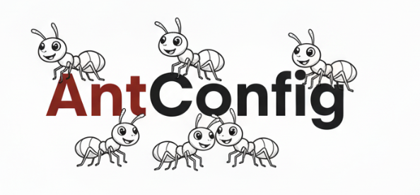

# AntConfig

AntConfig is a small, zero-dependency Go library for application configuration. It focuses on simplicity and clarity. Configuration is defined through tagged structs, which can be overridden by environment variables, a .env file, or command-line flags. Optional configuration files are supported in JSON or JSONC format only. Unlike many other configuration libraries that include support for TOML, YAML, and extensive feature sets, AntConfig is opinionated: it keeps things minimal, simple, and free of external dependencies.

## Features

- Zero dependencies: uses only the Go standard library.
- JSON and JSONC: helpers to strip comments and trailing commas for JSONC.
- Tag-based configuration: `default:"…"` and `env:"ENV_NAME"` on struct fields.
- Nested structs supported: including pointer fields (auto-initialized when needed).
- Type-safe env parsing: string, int/uint, bool, float64, and `[]int` from JSON.
- Supports .env files
- Discovery helpers: locate config file by walking upward from CWD or executable.

## Status and Precedence

Current precedence when applying configuration values:

1) Defaults from struct tags (`default:"…"`)
2) Configuration file (.json or .jsonc). If `ConfigPath` is not set, AntConfig auto-discovers `config.jsonc` or `config.json` starting from the current working directory and walking upward.
3) .env file (when `AntConfig.EnvPath` is set)
4) Environment variables (`env:"NAME"`) — override .env
5) Command line flags (`flag:"name"`) — highest priority

## Quick Start

```go
package main

import (
    "fmt"
    "os"
    "github.com/robfordww/antconfig"
)

type AppConfig struct {
    Heading string `env:"HEADING" default:"south"`
    Speed   int    `default:"42"`
    Database struct {
        Host    string `env:"DB_HOST" default:"localhost"`
        Ports   []int  `env:"DB_PORT" default:"[5432,3306]"`
        Encrypt bool   `env:"DB_ENCRYPT"`
        Auth struct {
            User string `env:"DB_USER" default:"user"`
            Pass string `env:"DB_PASSWORD" default:"password"`
        }
    }
}

func main() {
    // Example env overrides
    os.Setenv("HEADING", "north")
    os.Setenv("DB_HOST", "db.example")
    os.Setenv("DB_PORT", "[15432,13306]")

    var cfg AppConfig
    ant := &antconfig.AntConfig{}
    _ = ant.SetConfig(&cfg)
    if err := ant.WriteConfigValues(); err != nil {
        panic(err)
    }

    fmt.Printf("%+v\n", cfg)
}
```

Behavior shown above is verified in tests: defaults are set first, then env
vars (if non-empty) override them. Empty env values do not override defaults.

## JSONC Support

The `jsonc.go` helper lets you read JSONC (comments + trailing commas) and
turn it into strict JSON before unmarshaling.

```go
data, err := os.ReadFile("config_test.jsonc")
if err != nil { /* handle */ }

jsonBytes := antconfig.ToJSON(data) // or ToJSONInPlace(data)
if err := json.Unmarshal(jsonBytes, &cfg); err != nil { /* handle */ }
```

An example JSONC file is included at `config_test.jsonc`.

## Config Discovery Helpers

Two helpers return a config file path by walking parent directories up to a
limit (10 levels):

- `antconfig.LocateFromWorkingDir(filename)`
- `antconfig.LocateFromExe(filename)`

Both return the first match found or `ErrConfigNotFound` if not found.

## API Overview (package `antconfig`)

- `type AntConfig struct { EnvPath, ConfigPath string }`
  - `SetEnvPath(path string) error`: set `.EnvPath` and validate the file exists. When set, `.env` is loaded and variables are added to the process environment only if they are not already set. If `EnvPath` is not set, AntConfig auto-discovers a `.env` in the current working directory.
  - `SetConfigPath(path string) error`: set `.ConfigPath` and validate it exists.
  - `WriteConfigValues() error`: apply defaults, config file (JSON/JSONC), .env, env, then flag overrides to the config passed via `SetConfig`.
  - `SetFlagArgs(args []string)`: provide explicit CLI args (defaults to `os.Args[1:]`).
  - `SetFlagPrefix(prefix string)`: set optional prefix used for generated CLI flags.
  - `ListFlags(cfg any) ([]FlagSpec, error)`: return available flags with names and types.
  - `SetConfig(&cfg) error`: provide the config pointer for reflection when binding flags.
  - `BindConfigFlags(fs *flag.FlagSet) error`: register flags derived from your config onto a provided `FlagSet` (and bind it for later reads).

- Struct tags on `cfg` fields
  - `default:"…"`: default value used when field is zero-value.
  - `env:"ENV_NAME"`: if present and non-empty, overrides the field with a parsed value.
  - `flag:"name"`: if present, allows `--name value` (or `--name=value`) to override the field. When `SetFlagPrefix("config-")` is set, use `--config-name` instead.

## Dynamic Flag Usage

You can build CLI usage dynamically from your config struct. For example:

```go
var cfg AppConfig
ant := &antconfig.AntConfig{}
ant.SetFlagPrefix("config-") // optional
flags, _ := ant.ListFlags(&cfg)
fmt.Println("Config flags:")
for _, f := range flags {
    fmt.Printf("  --%s  (%s)\n", f.CLI, f.Kind)
}

// Populate a FlagSet and parse
fs := flag.NewFlagSet("myapp", flag.ExitOnError)
if err := ant.SetConfig(&cfg); err != nil { panic(err) }
if err := ant.BindConfigFlags(fs); err != nil { panic(err) }
_ = fs.Parse(os.Args[1:])
// Apply: defaults -> config file -> .env -> env -> flags (from FlagSet)
if err := ant.WriteConfigValues(); err != nil { panic(err) }
```

## Notes

- Nested structs and pointers to structs are traversed and initialized as needed.
- Empty env values do not override defaults.
- Not supported yet: maps, slices of non-int types (e.g., `[]string`), TOML/YAML input.

## Playground

A small playground command included under `cmd/`. Use it as a experimental testingground.

Build and run:

```bash
go build -o antapp ./playground
./antapp -config-host=localhost
```

## Testing

Run all tests:

```bash
go test ./...
```

The tests exercise defaults, env overrides, pointer initialization for nested
structs, discovery helpers, and JSONC parsing.

---

Feel free to open an issue or PR if you have any suggestions.
